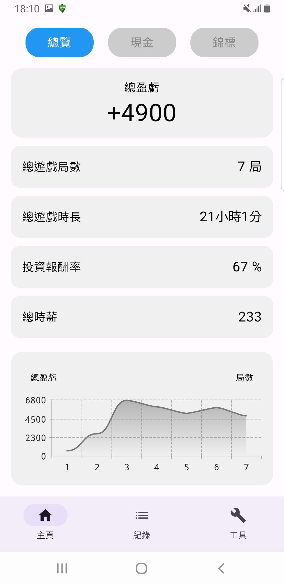
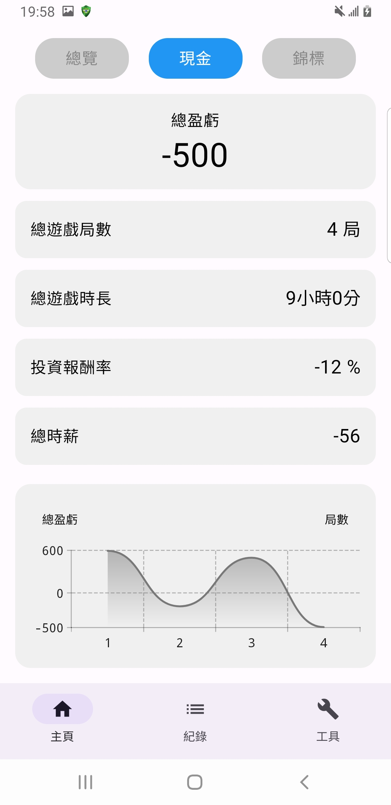
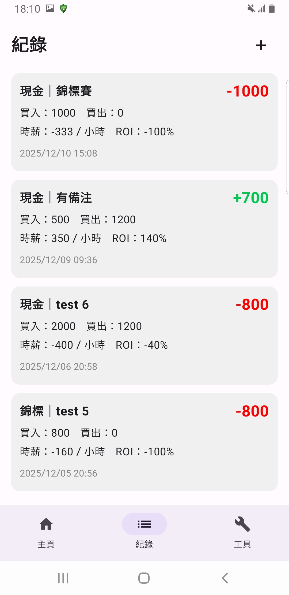
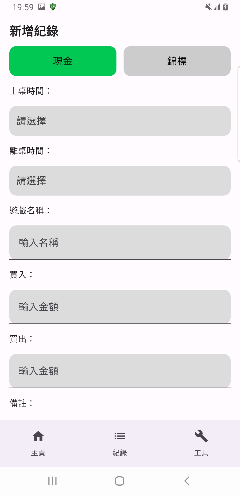
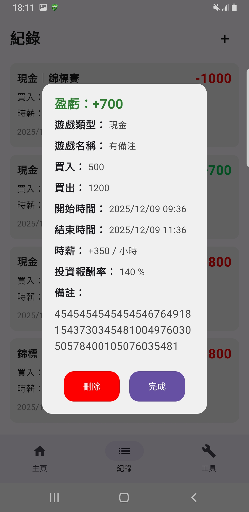
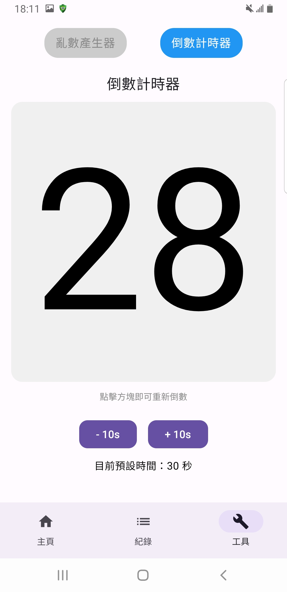
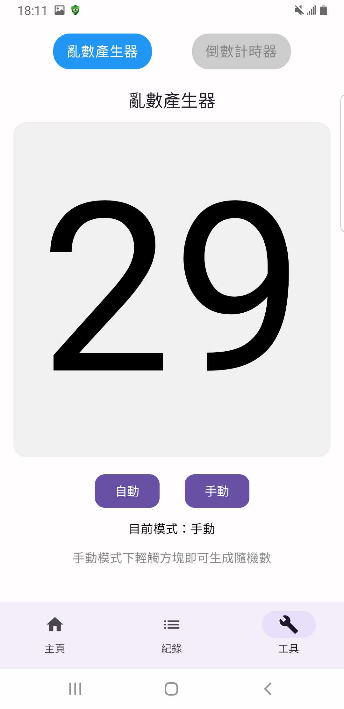

# 德州撲克記帳 App  
一款專為德州撲克玩家打造的記帳、統計與工具 App。  
支援現金桌／錦標賽、盈虧折線圖、時薪統計、亂數產生器、倒數計時器等功能。

---

# App Screenshots

## 主畫面：總覽 現金 錦標賽

  
  
  

---

## 紀錄：紀錄列表頁 新增紀錄頁 紀錄詳細頁（彈窗）

  
  
  

---

## 工具：亂數產生器 倒數計時器

  
  

---

# 功能特色

## 1. 戰績紀錄
支援兩種類型：現金桌（Cash Game）, 錦標賽（Tournament）

### 紀錄內容
- 遊戲類型
- 遊戲名稱
- 買入  
- 買出
- 開始時間
- 結束時間
- 盈虧（自動計算）  
- 時薪（自動計算）  
- 時長（自動計算）
- 投資報酬率(自動計算)

---

## 2. 主畫面統計
根據「總覽／現金／錦標」三種模式自動更新：

- 總盈虧  
- 遊戲局數  
- 總遊戲時長
- 投資報酬率（ROI）  
- 時薪
- 總累積營利
- 總累積虧損
- 場均盈虧
- 折線圖顯示累積盈虧趨勢

---

## 3. 工具頁
提供兩種專為玩家設計的功能：

### ● 倒數計時器
- 點擊灰底區塊可立即重新計時  
- 可使用 +10s / -10s 調整預設倒數秒數
- 幫助玩家控制思考時間

### ● 隨機數產生器
- 自動／手動模式  
- 每 3 秒自動更新（自動模式）  
- 手動點擊即可產生新亂數（手動模式）
- 幫助玩家做決策   

---

## 4. 彈出視窗顯示紀錄詳情 
- 支援刪除紀錄  

---

# Tech Stack

| 類別 | 使用技術 |
|------|----------|
| UI | Jetpack Compose |
| 資料庫 | Room |
| 架構 | MVVM |
| Asynchronous | Kotlin Coroutines + Flow |
| 圖表 | Vico |
| Navigation | Jetpack Navigation Compose |

---

# 開發進度 / Roadmap
### 現有功能
- [x] 現金／錦標分流記帳  
- [x] Vico 折線圖串接資料庫  
- [x] 紀錄詳情彈窗  
- [x] 隨機數產生器  
- [x] 倒數計時器  

### 下一階段

- [ ] 完成「編輯紀錄」功能   
- [ ] 設定頁功能  
- [ ] 更完整的錦標賽統計  
- [ ] 匯入／匯出資料  
- [ ] App Icon + Splash Screen  
